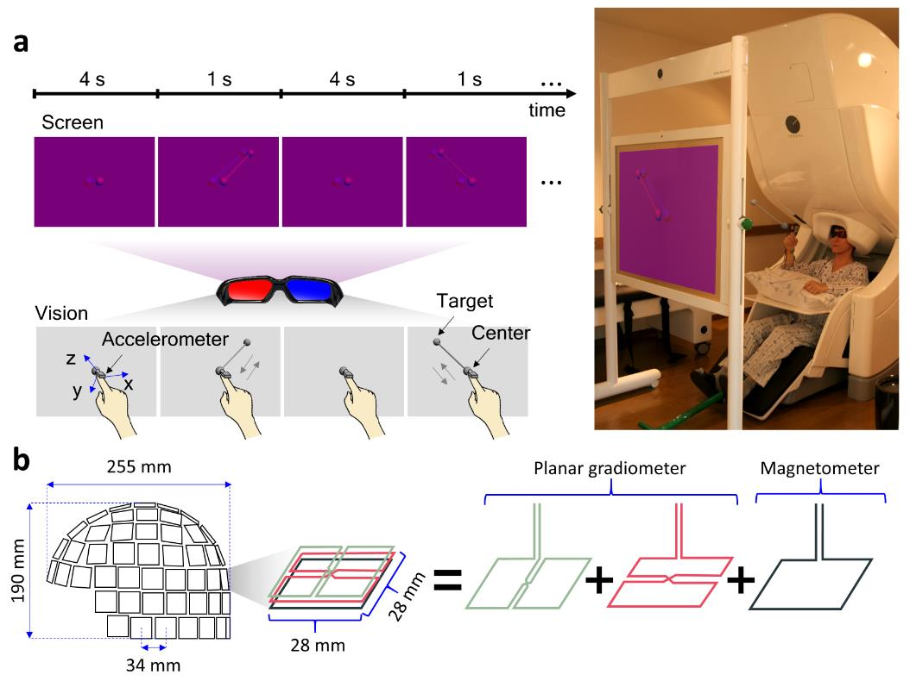

# Scientific_Data_2023

It is sample MATLAB codes for the manuscript entitled "[A magnetoencephalography dataset during three-dimensional reaching movements for brain-computer interfaces](https://www.nature.com/articles/s41597-023-02454-y)".
You can get the analysis results described in the manuscript by running the "SciData_code_v1.m" code.
A "topoplot" function and related sub-functions in the EEGLAB toolbox are needed to plot a topography. The EEGLAB software is available at https://sccn.ucsd.edu/eeglab30. For time-frequency analysis or FTF analysis, our custom MATLAB codes are required. It can be found at https://github.com/honggi82/Scientific_Data_2023. To use these toolboxes, the folders containing the toolboxes should be added to the "Set Path" of MATLAB.
The “Out of memory” error could occur when MEG data is processed because the data size is quite large. To this end, we recommend using a computer with a large amount of RAM and using 64-bit MATLAB and a 64-bit operating system (OS). We used Intel(R) Core(TM) i9-7900X 3.30GHz CPU, 64 GB RAM, a 64-bit Windows 10 OS, and a 64-bit MATLAB R2022a for the study. Moreover, we also recommend increasing the virtual memory and clearing unnecessary variables during the analysis.
